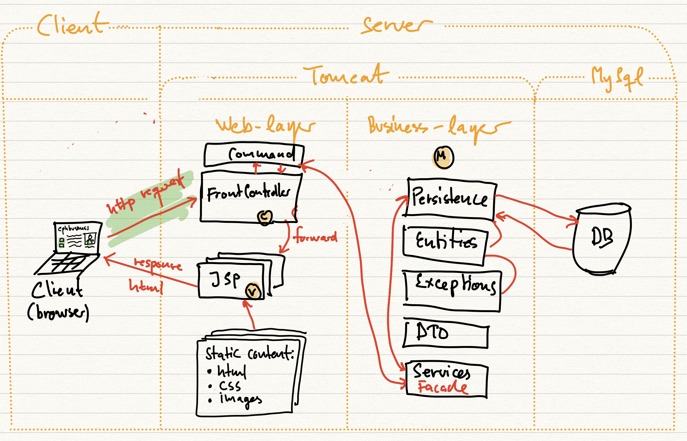

  

## Om projektet
Fog carport 2. semester eksamensprojekt. Produktet er en hjemmeside, hvor vi har løst en opgave for firmaet Johannes Fog. Vi har bygget et website, hvor man bl.a. kan bestille en skræddersyet carport og modtage en stykliste og en tegning af den model man har bestilt. Vi har bygget web-applikationen i Java, MySql, HTML, CSS, JS og Bootstrap og kører det på en Tomcat webcontainer. Arkitekturen er implementeret med et command-pattern og en front-controller.

Vores rapport omkring projektet kan tilgås og læses her '[dokumentation/rapport]()'.    
Projektet er udført af:
- [Andreas Fritzbøger](https://github.com/Wolfgang1235)
- [Mads Herlevsen](https://github.com/Mads725)
- [Owais Dashti](https://github.com/OwaisAD)
- [Thomas Fritzbøger](https://github.com/thomasfritzboger)

## Deployment på Droplet
Flere af os har uploadet til hver vores droplets. Her er de listet:
- [Deployment 1](http://134.209.250.205:8080/fogcarport/) <!--Owais-->
- [Deployment 2](http://46.101.240.195:8080/fog/) <!--Thomas-->
- [Deployment 3](http://64.225.97.221:8080/fog/) <!--Andreas-->

## Logbog
Her er et link til vores logbog
- [LOGBOG](https://docs.google.com/document/d/1hYZP6E3MkkmH_mHPWVnAW8JdBuTCLxNIA6XpuR8aLoA/edit?usp=sharing)

## Hvordan køres projektet?
1. Først skal du clone projektet eller downloade en zip-fil med projektet til din arbejdsstation.
2. Åbn Workbench og kør sql-filen `FogDB.sql`, som ligger under mappen `resources`. Den opretter de nødvendige databaser. 
3. Du skal nu lave en Tomcat konfiguration. Dvs, 
   1. klik på "Add Configuration ..."
   2. Klik på "+" og vælg "Tomcat Server Local".
   3. Klik på "Fix knappen"
   4. Vælg war-exploded som deployment type
   5. Nu kan du klikke på den grønne play-knap for at bygge og køre projektet.
4. Du skal nok ændre kodeord til databasen i projektet, så du kan tilgå den lokalt. Det gøres under model-delen i filerne: `/persistence/ConnectionPool` i linie 13 og 14. Du kan evt. klikke på Configuration i top-menuen -> Edit configurations -> Startup/Connection og lave to environment variabler. Den ene skal under Name hedde `db_un` og ud fra Value taster du dit MySQL brugernavn. Den anden skal hedde `db_up` under navn og skal have din MySQL kode under value. På den måde kan du tilgå scriptet.

## Bemærkninger
- Strukturering er i passende packages for overblik (MVC). Noget af strukturen er også givet af Maven, og kan ikke laves om. F.eks. opdelingen i `/java` og `/webapp`.

Funktionelt kan applikationen:
- Vise hhv. sider for brugeren og administrator.
- Kunden kan bestille en carport efter egne ønskede dimensioner. Bekræftes denne kan en stykliste fås i profilen.
- Administratoren kan bekræfte forespørgsler, fremsøge kunder, tjekke ordre og ændre på lagerholdning.
- Du kan oprette en bruger eller logge på en følgende roler:
    1. `kunde1@fog.dk` med password: `1234` (rolle: `kunde`)
    2. `kunde2@fog.dk` med password: `1234` (rolle: `kunde`)
    3. `admin@fog.dk` med password: `1234` (rolle: `admin`)
- Hvis man indtaster ugyldige data under indlogning, bliver man sendt til en en fejlside.

## MVC arkitektur med front-controller

